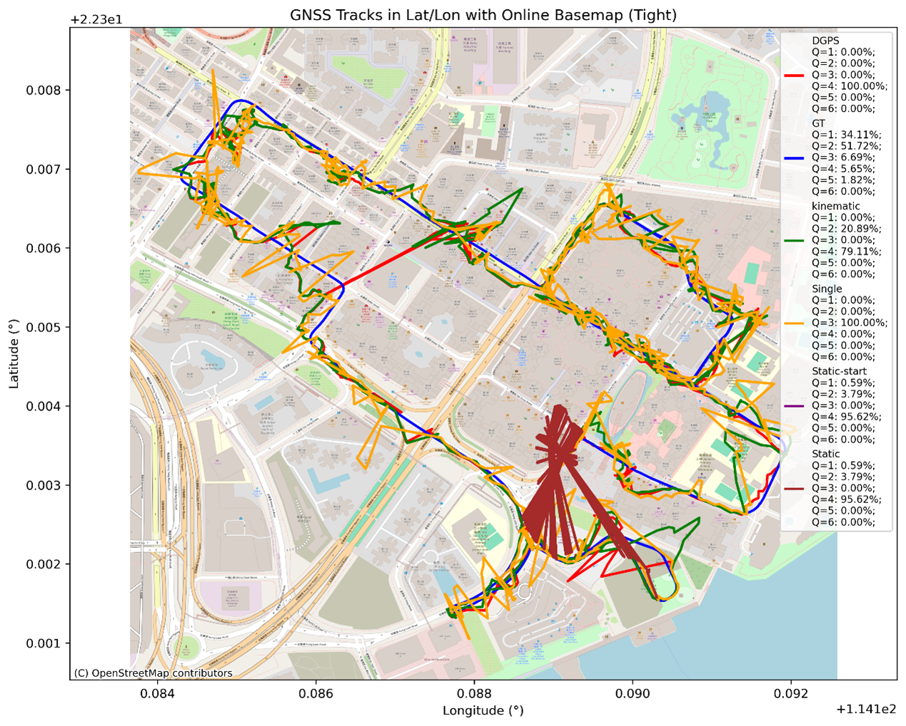
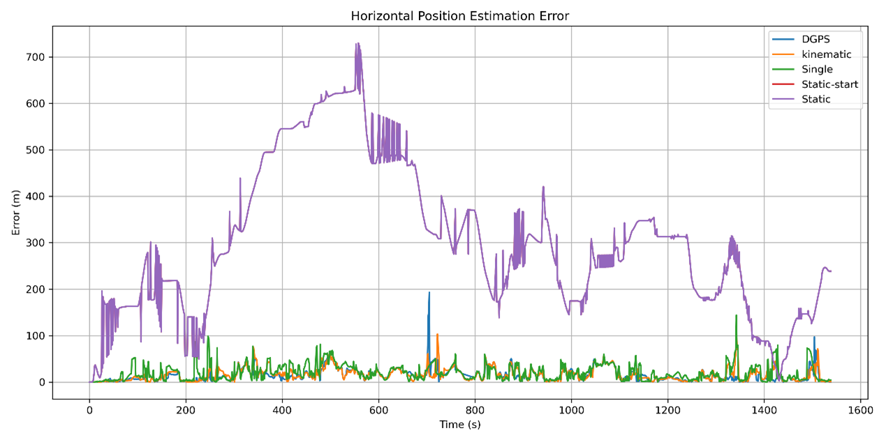
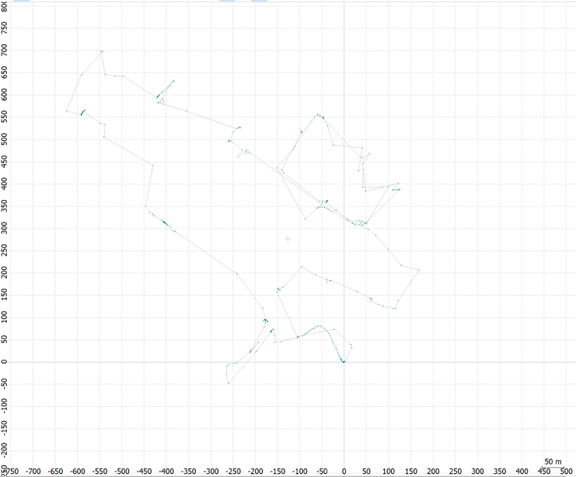

# LabReport
This is the lab report for Satellite Communication and Navigation course

Here’s a clean and well-structured **README** version of your document content:

---

## 1. GNSS Positioning Modes Analysis

### Parameters Tuned

#### Positioning Mode Overview
Positioning Mode refers to the strategy used by a GNSS (Global Navigation Satellite System) receiver or algorithm to estimate a user's location. Different modes affect satellite data processing, correction methods, and achievable accuracy.

| Mode           | Description |
|----------------|-------------|
| **Single**     | Basic positioning using one GNSS receiver with broadcast satellite data. Accuracy is meter-level. Uses only pseudorange observations. |
| **DGPS/DGNSS** | Differential GNSS with pseudorange corrections from a known reference station. Sub-meter accuracy. |
| **Kinematic**  | Uses carrier-phase observations and differential corrections. Solves integer ambiguities for centimeter-level precision. |
| **Static**     | RTK mode for stationary receivers. Commonly used to establish base station positions. |
| **Static-Start** | Begins in static mode, then switches to kinematic post-initialization. Useful when starting from a rest position. |
| **Moving-Base** | Both rover and base stations are mobile. Used for relative positioning between two moving platforms. |
| **Fixed**      | Base station at a known, fixed location used to provide RTK corrections. |
| **PPP Kinematic** | Precise Point Positioning for moving receivers, requiring precise satellite data but no nearby base station. |
| **PPP Static** | Static version of PPP for long-term, high-accuracy fixed-point positioning. |
| **PPP Fixed**  | PPP with integer-fixed carrier-phase ambiguities for improved accuracy. |

---

### Results

#### Urban Dataset

  
  

##### GNSS Track Comparison

A comparative figure (not included here) shows GNSS tracks overlaid on an OpenStreetMap basemap for various positioning modes.

- **Missing Results**: PPP Kinematic, PPP Static, and PPP Fixed modes failed to generate outputs—likely due to missing precise satellite data or inadequate quality (e.g., no dual-frequency phase observations).
- **Top Performer**: **Kinematic mode** delivered the most accurate trajectory, aligning closely with the road network and maintaining minimal deviation.
- **Worst Performer**: **Static mode** diverged significantly. Since it assumes a stationary receiver, it fails when applied to a dynamic dataset (e.g., walking or driving), resulting in poor ambiguity resolution and unrealistic estimates.

> **Kinematic mode Q-values**:  
> Q = 2 (float solution) in **20.85%** of observations — higher than all other modes.

---

##### Mode Comparison Across Urban Scenario

A second figure compares positioning performance across five modes: **DGPS, Kinematic, Single, Static-start, and Static**.

- **Kinematic Mode**:
  - Most accurate and stable.
  - Closely follows road boundaries and forms a clear loop.
  - **Q=1 (fixed)**: 44.88%, **Q=2 (float)**: 21.46%, **Total (Q=1 or Q=2)**: 66.34%
- **Static Mode**:
  - Displays chaotic patterns near the start.
  - Assumes stationarity—unsuitable for movement data.
- **Single Mode**:
  - Smoother than Static but less accurate.
  - 100% Q=3 (pseudorange-only), meter-level accuracy.
- **DGPS Mode**:
  - Consistently Q=4 (differential corrections only), no phase ambiguity resolution.
  - Sub-meter level accuracy, suitable for moderate-precision tasks.

Here’s your content reformatted into a clean and structured **README.md** format using Markdown:

---

## 2.

### Overview

This document presents the results of parameter tuning in a GNSS positioning experiment under the **PPP Kinematic mode**. Two primary parameters were tested:

1. **Frequencies**
2. **Filter Type**

---

### 1. Frequencies

#### Overview of GPS Frequency Bands

- **L1 (1575.42 MHz):** Public C/A code + military P(Y) code.
- **L2 (1227.60 MHz):** Originally military-only, now includes civilian L2C.
- **L5 (1176.45 MHz):** High-precision civilian use (e.g., aviation, railways).
- **L3 (1381.05 MHz):** Used for nuclear monitoring.
- **L4 (1379.913 MHz):** Experimental, for ionospheric studies.
- **L6 (1278.75 MHz):** Used by augmentation systems like Japan’s QZSS.

**Galileo Frequencies:**
- **E5a & E5b:** Used by the EU’s Galileo system; E5a matches GPS L5.

#### Frequency Options in Lab

- L1
- L1 + L2/E5b
- L1 + L2/E5b + L5/E5a
- L1 + L2/E5b + L5/E5a + L6

> Note: When selecting one frequency option, other configurations are left at default settings.

#### Results

##### L1 Only
- Achieved **highest positioning accuracy**.

##### L1 + L2/E5b
- Slightly lower accuracy than L1-only.

##### L1 + L2/E5b + L5/E5a
- Comparable to above, but still slightly lower than L1-only.

#### L1 + L2/E5b + L5/E5a + L6
- Similar accuracy, slightly lower than L1-only.

#### Conclusion

While multi-frequency modes should theoretically outperform single-frequency setups, in this case, **L1-only yielded the best accuracy**. Possible reasons include:

- Data quality
- Satellite geometry
- Software processing settings
- Convergence time

---

### 2. Filter Type

#### Filter Types Tested

- **Forward Filtering**  
  Processes data chronologically. Common in real-time applications.

- **Backward Filtering**  
  Processes data in reverse. Useful in post-processing for refining accuracy.

- **Combined Filtering**  
  Merges forward and backward filtering for highest accuracy (post-processing only).

#### Results (Under PPP Kinematic mode, using L1 Frequencies)

##### Forward Filter
- Standard accuracy with initial convergence limitations.

##### Backward Filter
- Improved accuracy over forward filtering.

##### Combined Filter
- **Highest positioning accuracy**.
- Benefits:
  - Corrects convergence issues.
  - Smooths out noise.
  - Resolves ambiguities more effectively.

---

### Final Notes

The study showed that:
- **L1-only frequency** provided the **best results** in this particular PPP Kinematic context.
- **Combined filtering** is the **most accurate filtering strategy**.

These outcomes highlight how parameter tuning can lead to unexpected yet insightful results in GNSS processing.

