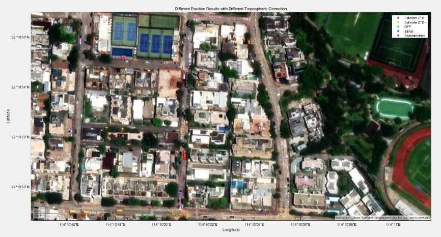
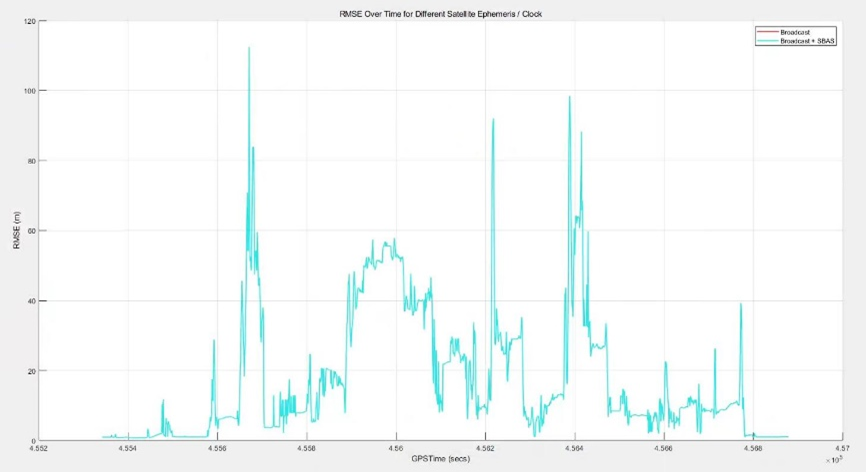
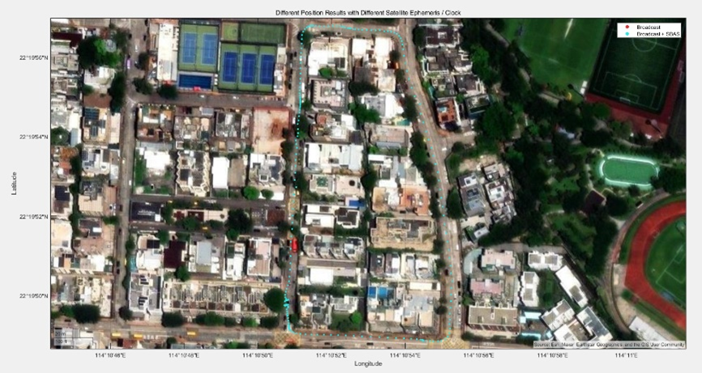
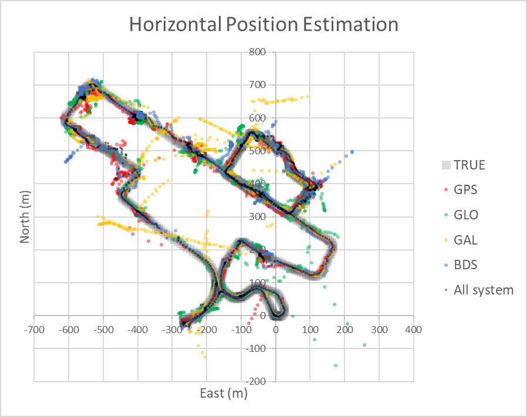
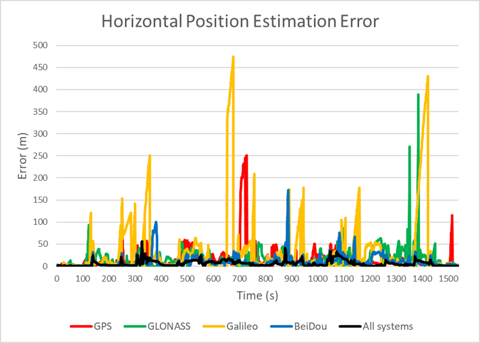
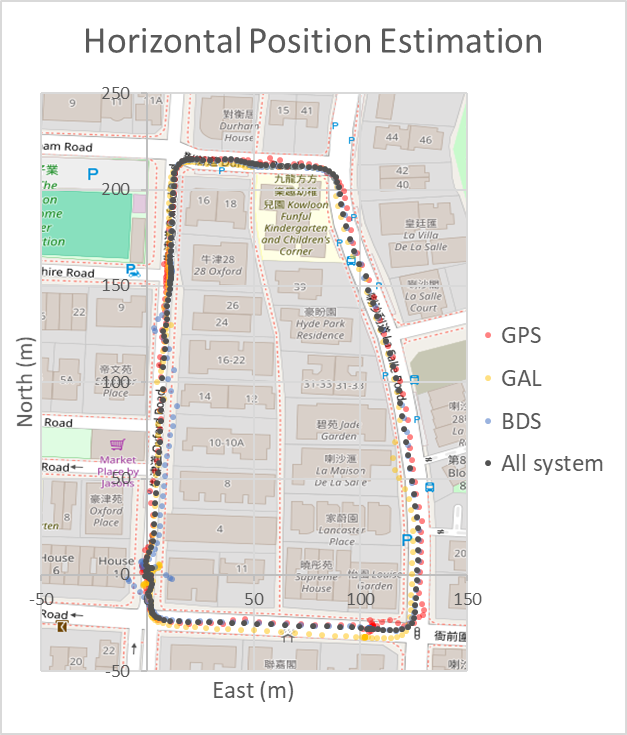

# Lab Report: Satellite Communication and Navigation Course

## Group 8: LO Long Yin, DU Hang, ZHANG Yifei, LOU Tengda, ZHAO Xinge, and ZHOU Huaiyuan

This document presents the lab report for the Satellite Communication and Navigation course, detailing the analysis of GNSS positioning modes, frequencies, filter types, and corrections.

---

## 1. GNSS Positioning Modes Analysis

### Overview of Positioning Modes

Positioning modes refer to the strategies employed by GNSS (Global Navigation Satellite System) receivers to estimate a user's location. Each mode influences satellite data processing, correction methods, and achievable accuracy.

| Mode                | Description                                                                                     |
|---------------------|-------------------------------------------------------------------------------------------------|
| **Single**          | Basic positioning using one GNSS receiver with broadcast satellite data. Accuracy is meter-level. |
| **DGPS/DGNSS**      | Differential GNSS with pseudorange corrections from a known reference station. Sub-meter accuracy. |
| **Kinematic**       | Utilizes carrier-phase observations and differential corrections for centimeter-level precision. |
| **Static**          | RTK mode for stationary receivers, commonly used to establish base station positions.          |
| **Static-Start**    | Begins in static mode, then switches to kinematic post-initialization. Useful for starting from a rest position. |
| **Moving-Base**     | Both rover and base stations are mobile, used for relative positioning between two moving platforms. |
| **Fixed**           | Base station at a known, fixed location providing RTK corrections.                             |
| **PPP Kinematic**   | Precise Point Positioning for moving receivers, requiring precise satellite data but no nearby base station. |
| **PPP Static**      | Static version of PPP for long-term, high-accuracy fixed-point positioning.                    |
| **PPP Fixed**       | PPP with integer-fixed carrier-phase ambiguities for improved accuracy.                        |

### Results

#### Urban Dataset

  
  

##### GNSS Track Comparison

A comparative figure (not included here) shows GNSS tracks overlaid on an OpenStreetMap basemap for various positioning modes.

- **Missing Results**: PPP Kinematic, PPP Static, and PPP Fixed modes failed to generate outputs—likely due to missing precise satellite data or inadequate quality (e.g., no dual-frequency phase observations).
- **Top Performer**: **Kinematic mode** delivered the most accurate trajectory, aligning closely with the road network and maintaining minimal deviation.
- **Worst Performer**: **Static mode** diverged significantly, as it assumes a stationary receiver, leading to poor ambiguity resolution and unrealistic estimates when applied to dynamic datasets.

> **Kinematic mode Q-values**:  
> Q = 2 (float solution) in **20.85%** of observations — higher than all other modes.

---

##### Mode Comparison Across Urban Scenario

A second figure compares positioning performance across five modes: **DGPS, Kinematic, Single, Static-start, and Static**.

- **Kinematic Mode**:
  - Most accurate and stable.
  - Closely follows road boundaries and forms a clear loop.
  - **Q=1 (fixed)**: 44.88%, **Q=2 (float)**: 21.46%, **Total (Q=1 or Q=2)**: 66.34%
- **Static Mode**:
  - Displays chaotic patterns near the start.
  - Assumes stationarity—unsuitable for movement data.
- **Single Mode**:
  - Smoother than Static but less accurate.
  - 100% Q=3 (pseudorange-only), meter-level accuracy.
- **DGPS Mode**:
  - Consistently Q=4 (differential corrections only), no phase ambiguity resolution.
  - Sub-meter level accuracy, suitable for moderate-precision tasks.

---

## 2. GNSS Frequencies and Filter Type

### Overview

This section presents the results of parameter tuning in a GNSS positioning experiment under the **PPP Kinematic mode**. Two primary parameters were tested:

1. **Frequencies**
2. **Filter Type**

### 1. Frequencies

#### Overview of GPS Frequency Bands

- **L1 (1575.42 MHz)**: Public C/A code + military P(Y) code.
- **L2 (1227.60 MHz)**: Originally military-only, now includes civilian L2C.
- **L5 (1176.45 MHz)**: High-precision civilian use (e.g., aviation, railways).
- **L3 (1381.05 MHz)**: Used for nuclear monitoring.
- **L4 (1379.913 MHz)**: Experimental, for ionospheric studies.
- **L6 (1278.75 MHz)**: Used by augmentation systems like Japan’s QZSS.

**Galileo Frequencies:**
- **E5a & E5b**: Used by the EU’s Galileo system; E5a matches GPS L5.

#### Frequency Options in Lab

- L1
- L1 + L2/E5b
- L1 + L2/E5b + L5/E5a
- L1 + L2/E5b + L5/E5a + L6

> Note: When selecting one frequency option, other configurations are left at default settings.

#### Results

##### L1 Only
- Achieved **highest positioning accuracy**.

  

##### L1 + L2/E5b
- Slightly lower accuracy than L1-only.

  

##### L1 + L2/E5b + L5/E5a
- Comparable to above, but still slightly lower than L1-only.

  

##### L1 + L2/E5b + L5/E5a + L6
- Similar accuracy, slightly lower than L1-only.

  

#### Conclusion

While multi-frequency modes should theoretically outperform single-frequency setups, in this case, **L1-only yielded the best accuracy**. Possible reasons include:

- Data quality
- Satellite geometry
- Software processing settings
- Convergence time

---

### 2. Filter Type

#### Filter Types Tested

- **Forward Filtering**: Processes data chronologically. Common in real-time applications.
- **Backward Filtering**: Processes data in reverse. Useful in post-processing for refining accuracy.
- **Combined Filtering**: Merges forward and backward filtering for highest accuracy (post-processing only).

#### Results (Under PPP Kinematic mode, using L1 Frequencies)

##### Forward Filter
- Standard accuracy with initial convergence limitations.

  

##### Backward Filter
- Improved accuracy over forward filtering.

  

##### Combined Filter
- **Highest positioning accuracy**.
- Benefits:
  - Corrects convergence issues.
  - Smooths out noise.
  - Resolves ambiguities more effectively.

  

---

### Final Notes

The study showed that:
- **L1-only frequency** provided the **best results** in this particular PPP Kinematic context.
- **Combined filtering** is the **most accurate filtering strategy**.

These outcomes highlight how parameter tuning can lead to unexpected yet insightful results in GNSS processing.

---

## 3. GNSS Masks, Dynamics, and Correction

### 🛠️ Parameters Tuned

#### Elevation Mask / SNR Mask

- **Elevation Mask**: Minimum satellite elevation angle (range: 0°–70°, step: 5°).
- **SNR Mask**: Minimum Signal-to-Noise Ratio (SNR) threshold to filter out weak or noisy satellite signals.

> Proper adjustment of these masks can help improve GNSS signal quality and positioning accuracy.

  

---

#### Receiver Dynamics / Earth Tides Correction

- **Receiver Dynamics**: Corrects for motion of the receiver (velocity, acceleration, rotation).
- **Earth Tides Correction**:
  - **OFF**: No correction
  - **Solid**: Corrects for solid Earth deformation due to tidal forces
  - **Solid/OTL**: Adds Ocean Tide Loading for coastal/ocean regions

> These corrections help improve precision, especially in dynamic or high-accuracy environments.

  

---

### Accuracy Evaluation Metrics

#### 1. Position Quality Indicator (Q)

| Q Value | Description         | Accuracy Level        |
|---------|---------------------|-----------------------|
| 1       | Fixed RTK           | Centimeter-level      |
| 2       | Float RTK           | Decimeter-level       |
| 3       | SBAS                | 1–3 meters            |
| 4       | DGPS                | 0.5–3 meters          |
| 5       | Single GNSS         | 3–50 meters           |
| 6       | PPP (Precise Point Positioning) | Centimeter–Decimeter |

> Q=1 is best, Q=2 is acceptable, and Q ≥ 4 indicates lower accuracy.

  

---

#### 2. RMSE (Root Mean Square Error)

Used to compare GNSS trajectory results against ground truth from the dataset.

  

---

### Impact of Parameter Changes

#### Elevation Mask / SNR Mask

##### Urban Dataset

- Elevation Mask from **25°–35°** improved Q=1 significantly.
- Higher than 50° caused Q=2 to drop sharply due to fewer visible satellites.

##### Dynamic Dataset

- Lower Elevation Masks (0°–15°) maintain more stable Q=1 and Q=2.
- Higher masks remove noisy signals but reduce available satellites, hurting accuracy.

  

---

#### Receiver Dynamics / Earth Tides Correction

- Enabling these corrections greatly improved **Q=2** results.
- **Q=4** remained largely unaffected.

  

---

### Analysis & Recommendations

#### Elevation Mask / SNR Mask

- Recommended Elevation Mask: **10°–15°**
- This provides a good balance between satellite count and signal quality.

#### Receiver Dynamics & Earth Tides Correction

- Should be enabled in **dynamic environments** or **high-precision applications**.
- Major improvements observed in Q=2 when these are turned ON.

---

### Conclusion

Careful tuning of Elevation Mask, SNR Mask, and enabling dynamic corrections (Receiver Dynamics + Earth Tides) can significantly enhance the accuracy and stability of GNSS positioning in varying environmental conditions.

---

## 4. GNSS Ionospheric and Tropospheric Correction

### Overview

This report evaluates GNSS positioning accuracy under different correction configurations for ionospheric and tropospheric effects, as well as satellite ephemeris/clock data sources. Both **Urban** and **Dynamic** datasets are analyzed.

---

### Parameters Tuned

#### 1. Ionospheric Correction

The ionosphere (50–1000 km above Earth) slows and refracts GNSS signals due to free electrons, introducing delays influenced by solar activity, time, and location.

| Option              | Description                                                                 |
|---------------------|-----------------------------------------------------------------------------|
| `OFF`               | Disables ionospheric correction; results in lower accuracy.                |
| `Broadcast`         | Uses satellite broadcast models (e.g., Klobuchar); limited improvement (~50%). |
| `SBAS`              | Satellite-Based Augmentation System; more accurate than broadcast.         |
| `Iono-Free LC`     | Uses dual-frequency observations to cancel ionospheric delay; high-precision. |
| `Estimate TEC`      | Estimates Total Electron Content from data; improves precision.            |
| `IONEX TEC`        | Uses global TEC maps (IONEX) from sources like IGS.                       |
| `QZSS Broadcast`    | Uses Japan’s QZSS ionospheric correction; requires QZSS support.          |

---

#### 2. Tropospheric Correction

The troposphere (0–50 km) affects all GNSS signals equally through temperature, pressure, and humidity changes.

| Option              | Description                                                                 |
|---------------------|-----------------------------------------------------------------------------|
| `OFF`               | No correction applied.                                                     |
| `Saastamoinen`      | Uses Saastamoinen model; good for high-precision applications.            |
| `SBAS`              | Applies SBAS correction.                                                  |
| `Estimate ZTD`      | Real-time Zenith Tropospheric Delay estimation.                           |
| `Estimate ZTD+`     | Enhanced ZTD estimation with meteorological data.                         |

---

#### 3. Satellite Ephemeris / Clock Data

These determine satellite positioning and time error corrections.

| Option                     | Description                                                                 |
|----------------------------|-----------------------------------------------------------------------------|
| `Broadcast`                | GNSS satellite-transmitted data; meter-level accuracy.                     |
| `Precise`                  | IGS-provided precise orbits; centimeter-level accuracy.                   |
| `Broadcast+SBAS`           | Enhanced broadcast with SBAS corrections.                                  |
| `Broadcast+SSR APC`        | Adds SSR Antenna Phase Center corrections.                                 |
| `Broadcast+SSR CoM`        | Adds SSR Center of Mass corrections.                                       |
| `QZSS LEX`                 | Uses QZSS LEX signal; requires support.                                    |

---

### Precision Evaluation Index

#### 1. Position Quality (Q)

| Q Value | Description         | Accuracy       |
|---------|---------------------|----------------|
| 1       | Fixed RTK           | Centimeter     |
| 2       | Float RTK           | Decimeter      |
| 3       | SBAS                | 1–3 meters     |
| 4       | DGPS                | 0.5–3 meters   |
| 5       | Single              | 3–50 meters    |
| 6       | PPP                  | Centimeter–decimeter |

- **In this study**, Q=1 is considered the most accurate, Q=2 acceptable, and Q ≥ 4 as low accuracy.

#### 2. RMSE (Root Mean Square Error)

Evaluates GNSS vs. ground truth:
RMSE = √( (1/N) ∑[ (X_GNSS - X_True)² + (Y_GNSS - Y_True)² + (Z_GNSS - Z_True)² ] )

---

### Experimental Results

#### 1. Ionospheric Correction

##### Urban Dataset

| Method              | Q=1 | Q=2 | Q=4 | Analysis |
|---------------------|-----|-----|-----|----------|
| OFF                  | 459 | 735 | 344 | Baseline |
| Broadcast            | 459 | 735 | 344 | No effect |
| Estimate TEC        | 318 ↓30% | 877 ↑19% | 343 ≈ | Noise affects ambiguity resolution |
| IONEX TEC           | 459 | 735 | 344 | No effect (possibly misconfigured) |
| Iono-Free LC        | 0 ↓100% | 240 ↓67% | 1157 ↑236% | Accuracy degrades |
| QZSS / SBAS         | 459 | 735 | 344 | No effect |

  

  

##### Dynamic Dataset

| Method              | Q=1 | Q=2 | Q=4 | Analysis |
|---------------------|-----|-----|-----|----------|
| OFF                  | 91  | 70  | 44  | Baseline |
| Broadcast            | 91  | 70  | 44  | No effect |
| Estimate TEC        | 87 ≈ | 74 ↑6% | 44 = | Minor effect |
| IONEX TEC           | 91  | 70  | 44  | No effect |
| Iono-Free LC        | 0 ↓100% | 51 ↓27% | 154 ↑250% | Accuracy degrades |
| QZSS / SBAS         | 91  | 70  | 44  | No effect |

  

---

#### 2. Tropospheric Correction

##### Urban Dataset

| Method              | Q=1 | Q=2 | Q=4 | Analysis |
|---------------------|-----|-----|-----|----------|
| OFF                  | 459 | 735 | 344 | Baseline |
| Estimate ZTD        | 415 ↓10% | 780 ↑6% | 343 ≈ | Estimation noise observed |
| Estimate ZTD+       | 425 ↓7% | 770 ↑5% | 343 ≈ | Similar to ZTD |
| Saastamoinen         | 459 | 735 | 344 | No effect |
| SBAS                 | 459 | 735 | 344 | No effect |

  

  

##### Dynamic Dataset

| Method              | Q=1 | Q=2 | Q=4 | Analysis |
|---------------------|-----|-----|-----|----------|
| OFF                  | 91  | 70  | 44  | Baseline |
| Estimate ZTD        | 103 ↑13% | 58 ↓17% | 44 ≈ | Real-time correction effective |
| Estimate ZTD+       | 103 ↑13% | 58 ↓17% | 44 ≈ | Consistent with ZTD |
| Saastamoinen         | 91  | 70  | 44  | No effect |
| SBAS                 | 91  | 70  | 44  | No effect |

  

---

#### 3. Satellite Ephemeris / Clock

| Ephemeris Method     | Urban (Q1/Q2/Q4) | Dynamic (Q1/Q2/Q4) | Notes |
|----------------------|------------------|---------------------|-------|
| Broadcast            | 459 / 735 / 344  | 91 / 70 / 44        | Baseline |
| Broadcast + SBAS     | 459 / 735 / 344  | 91 / 70 / 44        | No effect |
| Precise / SSR / LEX  | Failed           | Failed              | Processing errors |

---

### Analysis & Insights

#### Ionospheric Correction

- **Urban**: Broadcast/IONEX/QZSS/SBAS methods made no difference. TEC estimation decreased Q=1 due to possible real-time noise. Iono-Free LC severely degraded results.
- **Dynamic**: Less impact overall. Iono-Free LC still degraded Q=1 entirely.

  

#### Tropospheric Correction

- **Urban**: Estimation (ZTD/ZTD+) slightly reduced Q=1. Model-based methods had no improvement.
- **Dynamic**: ZTD estimation increased Q=1, showing real-time estimation is more effective in dynamic conditions.

  

  

  

#### Satellite Ephemeris/Clock

- Methods requiring SSR/LEX/Precise data failed due to errors. Broadcast + SBAS showed no improvement, possibly due to inactive SBAS.

---

### Recommendations

- **Data Quality**: In urban environments with poor satellite visibility (<6), correction methods may introduce false correlations. Multipath effects further reduce accuracy.
- **Model Adaptability**: Traditional correction models lack environmental adaptability.
- **Future Work**: Consider integrating **machine learning-based adaptive correction models** for better environmental adaptability, while balancing computational efficiency.

---

## 5. RAIM FDE and Satellite Selection in RTKLIB

### RAIM FDE

#### Description

RAIM FDE (Receiver Autonomous Integrity Monitoring Fault Detection and Exclusion) is an optional algorithm available in RTKLIB. The core concept of RAIM is to use satellite redundancy to detect and exclude faulty satellites. By doing so, the system maintains continuity and improves both the **accuracy** and **integrity** of position estimates.

- **Fault Detection**: Identifies unreliable satellite signals.
- **Fault Exclusion**: Automatically removes faulty satellites from the positioning calculation.
- **Integrity Assurance**: Helps prevent potentially dangerous outcomes from incorrect estimations.

#### Results

Activating RAIM FDE did **not** affect the position estimation results in the tested scenarios. This implies that no satellite faults were detected — a normal outcome, given the low probability of satellite faults in practice.

---

### Satellite Selection

#### Description

The number of available satellites depends on satellite visibility and receiver support. Factors affecting satellite availability include:

- **Obstructions** (e.g., buildings)
- **Receiver limitations**
- **Frequency selection** (e.g., not all satellites operate on the L1 band)

In general:

- **More satellites** → **Better accuracy** (due to extra redundancy)
- **More satellites** → **Higher processing time**

##### Computational Complexity

- **Acquisition & Tracking**: `O(n)`  
- **Positioning (WLS or EKF)**: `O(n²)`  
Where `n` is the number of satellites.

##### Supported Navigation Systems in RTKLIB

| System   | Ownership       | Active Satellites |
|----------|------------------|-------------------|
| GPS      | United States     | 31                |
| GLONASS  | Russia            | 24                |
| Galileo   | European Union    | 24                |
| BeiDou   | China             | 30                |
| QZSS     | Japan (Optional)  | -                 |
| SBAS     | Various (Augmentation) | -             |
| IRNSS    | India (Optional)  | -                 |

> *Note: QZSS, SBAS, and IRNSS were not detected in the Whampoa dataset and thus did not contribute to the measurements.*

#### Results

##### Whampoa Dataset

Average estimation errors (using only one satellite system):

- **GPS**: 16.3 m  
- **GLONASS**: 15.9 m  
- **Galileo**: 36.0 m  
- **BeiDou**: 10.4 m  

Key Observations:

- Certain locations show large error spikes, likely due to **NLOS (Non-Line-of-Sight)** conditions (e.g., tall buildings).
- Systems with fewer than three visible satellites at times became **unavailable**.
- **Combining all systems** reduces average error to **6.5 m** and corrects many error spikes via redundancy.

##### Kowloon Tong Dataset

While the **ground truth** is unknown, combining satellite systems produces:

- A **smoother trajectory**
- An **estimated path** that aligns well with the road
- More **consistent and realistic** results than using any single system

### Figures

- **Whampoa Dataset:** Horizontal position estimation using different satellite systems

  

- **Whampoa Dataset:** Estimation error comparison  

  

- **Kowloon Tong Dataset:** Horizontal position estimation with combined systems  

  

---
